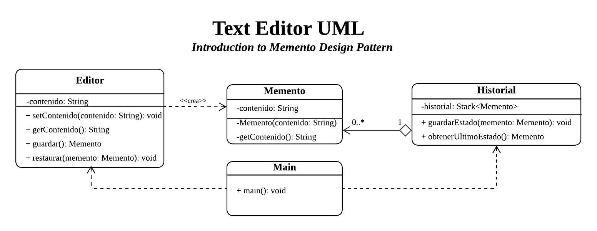

# Text Editor with History
> Introduction to the Memento Design Pattern
> Behavioral Pattern

## Description
A small text editor built with the **Memento** design pattern. It lets the user save the state of a document and return to a previous version through a history.

### Why use the Memento pattern in this case?
Memento is a behavioral pattern that lets you save and restore the previous state of an object without exposing the details of its implementation, preserving encapsulation.

This fits the needs of the context: a text editor with history, where the user can modify the text as many times as they want, save the current state at any moment, and restore the document to a previously saved version if a change is not wanted.

The pattern is a good fit because it produces snapshots of the editor that can be used later to restore a previous state.

### UML


1. **Editor** *Originator*: Represents the object whose state can change.
- Allows setting or modifying the document's content.
- Creates a Memento representing its current state.
- Restores a previous state using a Memento.

2. **Memento** *Memento*: A copy of the editor's state.

3. **History** *Caretaker*: Stores mementos and allows for the recovery of previous states.
- Stores mementos created by the editor.
- Must NOT directly modify the Editor's content.

4. **Main** *Client*: Executes the test scenario.

## Project Structure
```
src/
├── caretaker/
│   └── Historial.java
├── memento/
│   └── Memento.java
├── originator/
│   └── Editor.java
└── Main.java
```

## How to Run
Requirements: JDK 8 or higher.

From the `src` folder:

```bash
javac -d ../out caretaker/*.java memento/*.java originator/*.java Main.java
java -cp ../out Main
```

## Console Output
